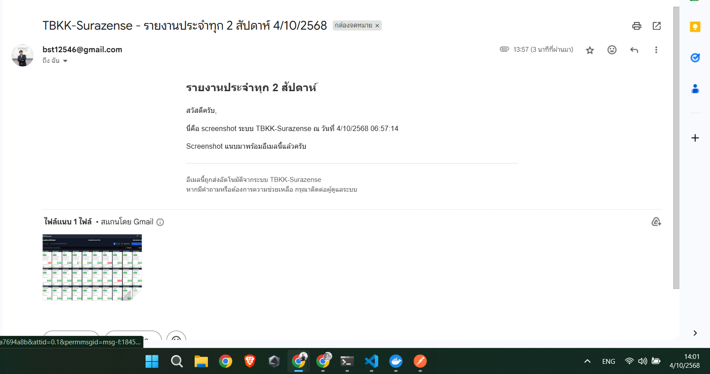

# 🖼️ Screenshot Report Cron Job (Vercel)

ระบบนี้ทำหน้าที่ **เปิดหน้าเว็บอัตโนมัติ, ล็อกอิน, แคปหน้าจอ (screenshot)** แล้ว **ส่งอีเมลแนบภาพรายงาน** โดยตั้งเวลาให้ทำงานอัตโนมัติผ่าน **Vercel Cron Job**

---

## ⚙️ คุณสมบัติหลัก

- ✅ รันผ่าน **Vercel Serverless Function**
- 🧩 ใช้ **Puppeteer + Chromium (Headless)** สำหรับ capture หน้าเว็บ
- 🔑 รองรับ **การล็อกอินอัตโนมัติ** ด้วย email/password จาก `.env`
- ✉️ แนบ screenshot แล้วส่งอีเมลผ่าน **Gmail SMTP**
- 🔐 ปลอดภัยด้วย **CRON_SECRET token**
- 🌐 รองรับ **ภาษาไทย / Dashboard Dynamic Rendering**
- ⏰ รันอัตโนมัติทุกระยะเวลาที่ตั้งไว้ (ทุก 2 สัปดาห์)

---

## 📂 โครงสร้างไฟล์

app/
└── api/
└── cron/
└── screenshot-report/
└── route.ts # ฟังก์ชันหลักสำหรับ Cron Job
.env.local

---

## 🕓 การตั้งค่า Cron Job บน Vercel

ไปที่ **Vercel Dashboard → Project → Settings → Cron Jobs**

เพิ่ม Job ใหม่ เช่น:

| Field | Value |
|--------|--------|
| **Path** | `/api/cron/screenshot-report` |
| **Schedule** | `0 9 */14 * *` (ทุก 14 วันตอน 09:00 น.) |
| **Region** | `all` |
| **Request Method** | `GET` |
| **Headers** | `Authorization: Bearer YOUR_CRON_SECRET` |

## 🧠 ขั้นตอนการทำงาน (Flow)

1. Cron Job เรียก API `/api/cron/screenshot-report` ด้วย token ที่ถูกต้อง  
2. ระบบเปิด **Chromium headless** → เข้า URL ที่กำหนด  
3. ใส่อีเมล/รหัสผ่าน และคลิก “Sign in”  
4. รอให้ dashboard โหลดข้อมูลจนเสร็จ  
5. แคปภาพเต็มหน้า (fullPage screenshot)  
6. ส่งอีเมลแนบภาพไปยังผู้รับที่กำหนดไว้  
7. ปิด browser และคืนค่า response JSON

---

## 📧 ตัวอย่างอีเมลที่ส่งออก

**เรื่อง:**  
TBKK-Surazense - รายงานประจำทุก 2 สัปดาห์ 9/10/2568

**เนื้อหา:**  
สวัสดีครับ,
นี่คือ screenshot ระบบ TBKK-Surazense ณ วันที่ 9/10/2568 09:00 น.
Screenshot แนบมาพร้อมอีเมลนี้แล้วครับ

**ไฟล์แนบ:**  
tbkk-report-<timestamp>.png

---

## 🧪 ทดสอบเรียก Cron API ด้วยตนเอง

### ตัวอย่างใช้ `curl`

curl -X GET https://fe-suratech-sensor-test.vercel.app/api/cron/screenshot-report /
  -H "Authorization: Bearer YOUR_CRON_SECRET"

### ตัวอย่าง .env.local

    NEXT_PUBLIC_API_BASE_URL=https://api.suratech.sensors.thetigerteamacademy.net
    GMAIL_USER=<YOUR_EMAIL>
    GMAIL_APP_PASSWORD=xxx xxx xxx xxx
    CRON_SECRET=<USE_YOUR_SECRET_KEY OR CREATE_NEW_SECRET_KEY_BY_YOUR_SELF>
    NEXT_PUBLIC_BASE_URL=https://fe-suratech-sensor-test.vercel.app
    REPORT_RECIPIENTS=<Email_for_receiving_information -> Example <test1@gmail.com,test2@gmail.com>> 

**ตัวอย่าง**

